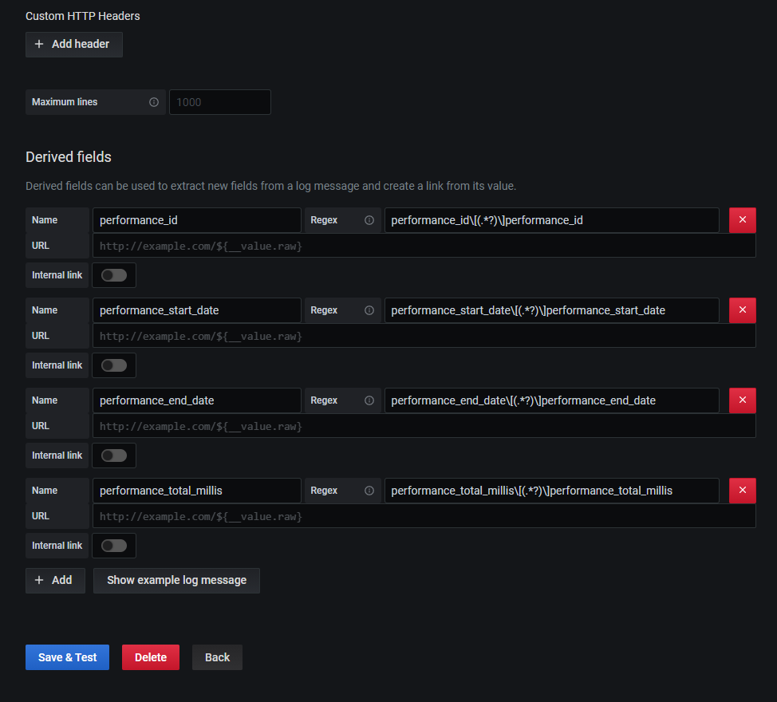

# Spring Boot + AOP + Grafana

Esta é uma aplicação feita como prova de conceito (POC)
para criação de logs de tempo execução de métodos 
públicos de classes específicas de um projeto, 
escolhidas pelo dev por meio de uma anotação ([@Monitor](src/main/java/com/maolabs/forms/external/primary/http/config/aop/Monitor.java)), 
utilizando [AOP](https://en.wikipedia.org/wiki/Aspect-oriented_programming), 
e mostrando os resultados no [Grafana](https://grafana.com/) 
com auxílio do [Grafana Loki](https://grafana.com/oss/loki/) e [Promtail](https://grafana.com/docs/loki/latest/clients/promtail/). Loki é um sistema de agregação de logs inspirado no [Prometheus](https://prometheus.io/).

As ideias são:

1. Centralizar a lógica de logs em um único lugar, por isso escolhido AOP.
2. Monitorar apenas classes específicas, por isso criada uma anotação customizada.
3. Exibir na forma de gráfico as dependências externas da aplicação e seus impactos 
na performance de um caso de uso, por isso o escohido o gráfico de Gantt e Grafana.
4. Possibilitar o filtro de uma única requisição, a partir dos logs, por isso Loki.

Também estou utilizando esse projeto para estudo prático da 
arquitetura [Hexagonal](https://alistair.cockburn.us/hexagonal-architecture/]) (que bem que poderia se chamar `Poligonal`...)


Arquitetura Hexagonal (in progress)


Organização dos pacotes (in progress)


## Como executar o projeto

Há algumas convenções de nome neste passo-a-passo, assim,
observe atentamente os valores de variável.

Na pasta raiz do projeto execute.

```bash
./mvnw spring-boot:run
```

Execute uma requisição para gerar os logs de execução dos métodos.
 O logs são gerados no arquivo em `./grafana-loki/meulog.log`. Por exemplo, com
o powershell:

```shell script
 wget http://localhost:8080/forms/1
```


Acesse o diretório `grafana-loki`. Lá está o arquivo [docker-compose.yaml](https://grafana.com/docs/loki/latest/installation/docker/).
 Execute o comando para levantar os containers:

```
docker-compose up -d
```

Verique no dashboard do Docker (quanto executado no Windows) que
as imagens estão sendo executadas (grafana + loki + promtail):


Abra seu navegador e acesse o Grafana no endereço a seguir. O login
e senha padrão são admin e admin.

```
http://localhost:3000/
```

Acesse o menu "Data Source".


Adicione Loki.


Em url utilize `http://loki:3100`.


Crie os campos derivados. Eles são extraídos de cada linha do log:



Acesse a imagem do Grafana e instale o [plugin do gráfico de 
Gantt](https://grafana.com/grafana/plugins/marcusolsson-gantt-panel/installation).

```
grafana-cli plugins install marcusolsson-gantt-panel
```


Em seguida reinicie o container do Grafana (pode ser feito pela própria UI do Dashboard do Docker).

Acesse o menu Dashboards do Grafana e adicione um novo dashboard.


Execute o filtro nos logs:

```
{job="formsapp"} |="performancegantt" |="HH:MM"
```

Onde HH:MM é o horário que você executou a requisição. Exemplo:


Você pode ocultar algumas colunas:


Selecione o Gráfico de Gantt, em visualização:
 

 
Habilite as funcionalidades experimentais:


Configure os campos (dimensões) que servirão de base para o gráfico de Gantt.


Por fim será exibido o gráfico de Gantt que representa o fluxo 
interno da aplicação, exibindo todas as classes que foram anotadas
com [@Monitor](src/main/java/com/maolabs/forms/external/primary/http/config/aop/Monitor.java) (uma anotação customizada para ser usada como filtro nos logs via AOP).


## Citações do artigo sobre arquitetura hexagonal

"O padrão de portas e adaptadores é escrito deliberadamente fingindo que todas as portas são fundamentalmente semelhantes. Essa pretensão é útil no nível arquitetônico. Na implementação, portas e adaptadores aparecem em dois sabores, que chamarei de '' primário '' e '' secundário '', por razões que logo se tornarão óbvias. Eles também podem ser chamados de adaptadores '' condutores '' e adaptadores '' conduzidos ''."

"A especificação funcional do aplicativo, talvez em casos de uso, é feita contra a interface do hexágono interno e não contra qualquer uma das tecnologias externas que podem ser usadas"

## Contribuindo

PR são bem-vindos. Para mudanças importantes, abra uma issue primeiro para discutir o que você gostaria de mudar.